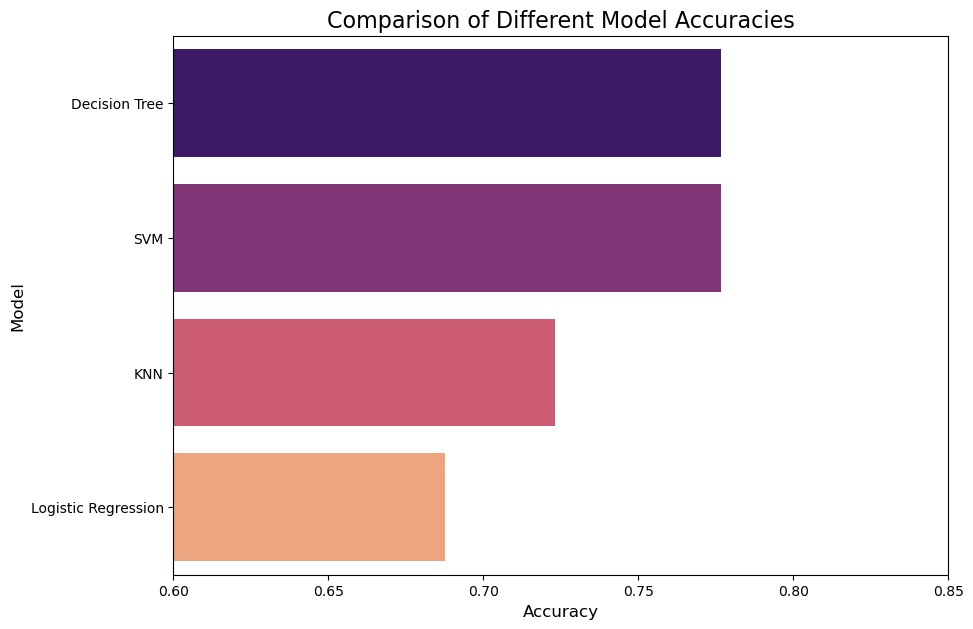

# مقایسه مدل‌های یادگیری ماشین برای پیش‌بینی بیماری آلزایمر

این پروژه یک تحلیل کامل برای پیش‌بینی وضعیت زوال عقل (Demented/Nondemented) با استفاده از داده‌های کلینیکی و MRI از مجموعه داده OASIS است. در این پروژه، عملکرد چهار الگوریتم طبقه‌بندی محبوب مقایسه شده است.

---

### **مراحل انجام پروژه**
فرآیند انجام این پروژه شامل مراحل کلیدی زیر است:
1.  **پاک‌سازی داده (Data Cleaning):** مدیریت مقادیر گمشده و داده‌های تکراری.
2.  **تحلیل اکتشافی داده (EDA):** مصورسازی داده‌ها برای درک بهتر الگوها، مانند توزیع سنی بیماران.
3.  **پیش‌پردازش (Preprocessing):** کدگذاری متغیرهای категоریال (مانند جنسیت) به فرمت عددی.
4.  **تقسیم داده‌ها:** جداسازی داده‌ها به دو مجموعه آموزشی (Training) و آزمایشی (Testing).
5.  **ساخت و ارزیابی مدل‌ها:** پیاده‌سازی و ارزیابی چهار مدل مختلف:
    * رگرسیون لجستیک (Logistic Regression)
    * درخت تصمیم (Decision Tree)
    * K-نزدیک‌ترین همسایه (KNN)
    * ماشین بردار پشتیبان (SVM)
6.  **مقایسه نهایی:** مقایسه دقت (Accuracy) و سایر معیارهای ارزیابی مدل‌ها برای انتخاب بهترین الگوریتم.

---

### **ابزارها و کتابخانه‌ها**
* **زبان:** پایتون (Python 3)
* **کتابخانه‌ها:** Pandas, NumPy, Seaborn, Matplotlib, Scikit-learn

---

### **نتیجه کلیدی**
در میان مدل‌های ارزیابی‌شده، **درخت تصمیم (Decision Tree)** با **دقت ۷۹.۵٪** بهترین عملکرد را روی داده‌های آزمایشی از خود نشان داد.

